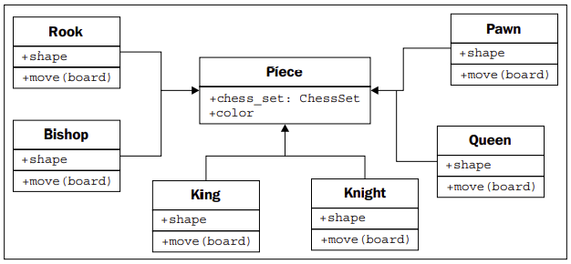

# Module 1/3: Python 3 Object-Oriented Programming - Second Edition

## Chapter 1: Object-oriented Design

In software development, design is often considered as the step done before
programming. This isn't true; in reality, analysis, programming, and design tend to
overlap, combine, and interweave. In this chapter, we will cover the following topics:
* What object-oriented means
* The difference between object-oriented design and object-oriented
programming
* The basic principles of an object-oriented design
* Basic Unified Modeling Language (UML) and when it isn't evil

### Introducing object-oriented

If you've read any hype, you've probably come across the terms object-oriented
analysis, object-oriented design, object-oriented analysis and design, and objectoriented programming. These are all highly related concepts under the general
object-oriented umbrella.

In fact, **analysis, design, and programming** are all stages of software development.
Calling them object-oriented simply specifies what style of software development
is being pursued.

**Object-oriented analysis (OOA)** is the process of looking at a problem, system, or
task (that somebody wants to turn into an application) and identifying the objects
and interactions between those objects. The analysis stage is all about what needs
to be done.

The output of the analysis stage is a set of requirements. If we were to complete the
analysis stage in one step, we would have turned a task, such as, I need a website,
into a set of requirements. 

**Object-oriented design (OOD)** is the process of converting such requirements into
an implementation specification. The designer must name the objects, define the
behaviors, and formally specify which objects can activate specific behaviors on
other objects. The design stage is all about how things should be done.

The output of the design stage is an implementation specification. If we were
to complete the design stage in a single step, we would have turned the requirements
defined during object-oriented analysis into a set of classes and interfaces that could
be implemented in (ideally) any object-oriented programming language.

**Object-oriented programming (OOP)** is the process of converting this perfectly
defined design into a working program that does exactly what the CEO
originally requested.

### Objects and classes

What's the difference between an object and a class? **Classes describe objects.** They
are like blueprints for creating an object. You might have three oranges sitting on
the table in front of you. Each orange is a distinct object, but all three have the
attributes and behaviors associated with one class: the general class of oranges.

The relationship between classes of objects system can
be described using a **Unified Modeling Language** (invariably referred to as **UML**,
because three letter acronyms never go out of style) class diagram.

**UML** is very popular among managers, and occasionally disparaged by programmers.
The syntax of a UML diagram is generally pretty obvious; you don't have to read a
tutorial to (mostly) understand what is going on when you see one. UML is also fairly
easy to draw, and quite intuitive. After all, many people, when describing classes
and their relationships, will naturally draw boxes with lines between them. Having
a standard based on these intuitive diagrams makes it easy for programmers to
communicate with designers, managers, and each other.

### Hiding details and creating the public interface

The key purpose of modeling an object in object-oriented design is to determine what
the public **interface** of that object will be. The interface is the collection of attributes
and methods that other objects can use to interact with that object. They do not need,
and are often not allowed, to access the internal workings of the object.

This process of hiding the implementation, or functional details, of an object is
suitably called **information hiding**. It is also sometimes referred to as **encapsulation**,
but encapsulation is actually a more all-encompassing term. Encapsulated data is
not necessarily hidden. Encapsulation is, literally, creating a capsule and so think
of creating a time capsule. If you put a bunch of information into a time capsule,
lock and bury it, it is both encapsulated and the information is hidden. On the other
hand, if the time capsule has not been buried and is unlocked or made of clear
plastic, the items inside it are still encapsulated, but there is no information hiding.

The model is an **abstraction** of a real concept.

**Abstraction** is another object-oriented concept related to encapsulation and
information hiding. Simply put, abstraction means dealing with the level of detail
that is most appropriate to a given task. It is the process of extracting a public
interface from the inner details. A driver of a car needs to interact with steering,
gas pedal, and brakes. The workings of the motor, drive train, and brake subsystem
don't matter to the driver. A mechanic, on the other hand, works at a different level
of abstraction, tuning the engine and bleeding the breaks. Here's an example of two
abstraction levels for a car

Now, we have several new terms that refer to similar concepts. Condensing all
this jargon into a couple of sentences: **abstraction** is the process of **encapsulating**
information with separate public and private **interfaces**. The private interfaces can
be subject to **information hiding**.

When designing the interface, try placing yourself in the object's shoes and imagine
that the object has a strong preference for privacy. Don't let other objects have access
to data about you unless you feel it is in your best interest for them to have it. Don't
give them an interface to force you to perform a specific task unless you are certain
you want them to be able to do that to you.

### Composition
Most design patterns rely on two basic object-oriented principles known as **composition** and 
**inheritance**. Composition is simpler, so let's start with it.

Composition is the act of collecting several objects together to create a new one.
Composition is usually a good choice when one object is part of another object.
We've already seen a first hint of composition in the mechanic example. A car is
composed of an engine, transmission, starter, headlights, and windshield, among
numerous other parts. The engine, in turn, is composed of pistons, a crank shaft, and
valves. In this example, composition is a good way to provide levels of abstraction.
The car object can provide the interface required by a driver, while also providing
access to its component parts, which offers the deeper level of abstraction suitable
for a mechanic. Those component parts can, of course, be further broken down if the
mechanic needs more information to diagnose a problem or tune the engine.

aggregate - a  whole formed by combining several separate elements.

**Aggregation** is almost exactly like composition. The difference is that aggregate
objects can exist independently. It would be impossible for a position to be associated
with a different chess board, so we say the board is composed of positions. But the
pieces, which might exist independently of the chess set, are said to be in an aggregate
relationship with that set.

Another way to differentiate between aggregation and composition is to think about
the lifespan of the object. If the composite (outside) object controls when the related
(inside) objects are created and destroyed, composition is most suitable. If the related
object is created independently of the composite object, or can outlast that object,
an aggregate relationship makes more sense. Also, keep in mind that composition
is aggregation; aggregation is simply a more general form of composition. Any
composite relationship is also an aggregate relationship, but not vice versa.

In practice, the distinction between aggregation and composition is often irrelevant once you
get past the design stage. When implemented, they behave in much the same way.
However, it can help to differentiate between the two when your team is discussing
how the different objects interact. Often, you can treat them as the same thing, but
when you need to distinguish between them, it's great to know the difference (this
is abstraction at work).

### Inheritance
**Inheritance** is the most famous, wellknown, and over-used relationship in object-oriented programming. Inheritance is sort
of like a family tree. My grandfather's last name was Phillips and my father inherited
that name. I inherited it from him (along with blue eyes and a penchant for writing).
In object-oriented programming, instead of inheriting features and behaviors from a
person, one class can inherit attributes and methods from another class.

For example, there are 32 chess pieces in our chess set, but there are only six different
types of pieces (pawns, rooks, bishops, knights, king, and queen), each of which
behaves differently when it is moved. All of these classes of piece have properties,
such as color and the chess set they are part of, but they also have unique shapes
when drawn on the chess board, and make different moves. Let's see how the six
types of pieces can inherit from a Piece class:

### Inheritance provides abstraction
Let's explore the longest word in object-oriented argot. **Polymorphism** is the ability to
treat a class differently depending on which subclass is implemented. We've already
seen it in action with the pieces system we've described. If we took the design a bit
further, we'd probably see that the Board object can accept a move from the player and
call the move function on the piece. The board need not ever know what type of piece
it is dealing with. All it has to do is call the move method, and the proper subclass will
take care of moving it as a Knight or a Pawn.

Polymorphism is pretty cool, but it is a word that is rarely used in Python
programming. Python goes an extra step past allowing a subclass of an object to be
treated like a parent class. A board implemented in Python could take any object that
has a move method, whether it is a bishop piece, a car, or a duck. When move is called,
the Bishop will move diagonally on the board, the car will drive someplace, and the
duck will swim or fly, depending on its mood.

This sort of polymorphism in Python is typically referred to as duck typing: "If it
walks like a duck or swims like a duck, it's a duck". We don't care if it really is a duck
(inheritance), only that it swims or walks. Geese and swans might easily be able to
provide the duck-like behavior we are looking for. This allows future designers to
create new types of birds without actually specifying an inheritance hierarchy for
aquatic birds. It also allows them to create completely different drop-in behaviors that
the original designers never planned for. For example, future designers might be able
to make a walking, swimming penguin that works with the same interface without
ever suggesting that penguins are ducks.

### Multiple inheritance

Object-oriented design can also feature such **multiple inheritance**, which allows a
subclass to inherit functionality from multiple parent classes. In practice, multiple
inheritance can be a tricky business, and some programming languages (most
notably, Java) strictly prohibit it. However, multiple inheritance can have its uses.
Most often, it can be used to create objects that have two distinct sets of behaviors.
For example, an object designed to connect to a scanner and send a fax of the
scanned document might be created by inheriting from two separate scanner and
faxer objects.

As long as two classes have distinct interfaces, it is not normally harmful for a
subclass to inherit from both of them. However, it gets messy if we inherit from two
classes that provide overlapping interfaces. For example, if we have a motorcycle
class that has a move method, and a boat class also featuring a move method,
and we want to merge them into the ultimate amphibious vehicle, how does the
resulting class know what to do when we call move? At the design level, this needs
to be explained, and at the implementation level, each programming language has
different ways of deciding which parent class's method is called, or in what order.
Often, the best way to deal with it is to avoid it. If you have a design showing up like
this, you're probably doing it wrong. Take a step back, analyze the system again, and
see if you can remove the multiple inheritance relationship in favor of some other
association or composite design.